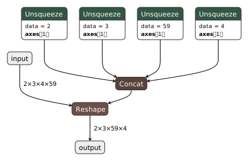
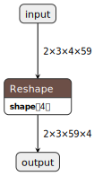
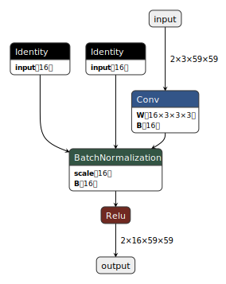
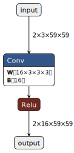
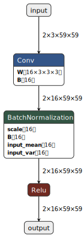

Here I show how one can use an onnx simplifer library.
It's now integrated to torch.onnx module, so you don't need to use it directly, you can just set a specific parameter `do_constant_folding=True` when exporting the model.
So, original example from [onnx-simplifier](https://github.com/daquexian/onnx-simplifier) has to be changed a bit. 
In general, results between onnx-simplifier and torch.onnx with `do_constant_folding=True` can differ, one of such cases is shown in the second example.

## Reshape
```python
import torch

class JustReshape(torch.nn.Module):
    def __init__(self):
        super(JustReshape, self).__init__()

    def forward(self, x):
        return x.view((x.shape[0], x.shape[1], x.shape[3], x.shape[2]))

net = JustReshape()
model_name = 'just_reshape.onnx'
dummy_input = torch.randn(2, 3, 4, 59)
torch.onnx.export(net, dummy_input, model_name, input_names=['input'], output_names=['output'], do_constant_folding=False)
```
That's the result without using simplification. I used [netron.app](netron.app) for the visualisation. \



```python
model_name = 'just_reshape_sim.onnx'
torch.onnx.export(net, dummy_input, model_name, input_names=['input'], output_names=['output'], do_constant_folding=True)
```
Result with folding. \


You can also simplify a model with a simplifier library directly
```bash
onnxsim "just_reshape.onnx" "just_reshape_sim2.onnx"
```
Result with sinplifier. \


## ConvBlock
A simple example, where the results differ.

```python
conv_block = torch.nn.Sequential(torch.nn.Conv2d(3, 16, 3, padding=1), torch.nn.BatchNorm2d(16), torch.nn.ReLU())
model_name = 'conv.onnx'
dummy_input = torch.randn(2, 3, 59, 59)
torch.onnx.export(conv_block, dummy_input, model_name, input_names=['input'], output_names=['output'], do_constant_folding=False)
```


```python
model_name = 'conv_sim.onnx'
torch.onnx.export(conv_block, dummy_input, model_name, input_names=['input'], output_names=['output'], do_constant_folding=True)
```
Result with folding. \


```bash
onnxsim "conv.onnx" "conv_sim2.onnx"
```

Result with simplifier. \

